# AI-Driven Development Workflow

**Author:** Maryam Altawil

## 🚀 Project Overview

This project is a full-stack web application built with:

- Frontend: Angular
- Backend: Node.js + Express
- Data: JSON-based driver KPI dataset
- Hosting: Hostinger (production), GitHub (source control)

The development approach emphasizes effective and transparent use of AI tools such as ChatGPT throughout all project phases, enhancing productivity, accuracy, and creativity. As part of this effort, I also utilized DeepSeek to explore best practices, code structures, and optimization strategies. For UI inspiration and refinement, Dribbble.com was used to source professional design patterns and layout ideas.

👉 If you’d like to see the live website, you can visit it here: https://la-home.qadi-tech.com/

## 1. AI in User Stories & Planning

### Tools Used:
- ChatGPT
- Canva (AI wireframes & UX mockups)

### Approach:
- Defined user requirements and translated them into user stories using ChatGPT prompts.
- Generated basic wireframes and UX flow using Canva AI.
- Mapped out features such as: KPI dashboard, filtering, chart views, driver tracking (GPS), and performance trends.

## 2. AI in Code Generation

### Tools Used:
- ChatGPT for TypeScript, Angular, Node.js, SQL generation
- DeepSeek for code structuring and enhancement suggestions

### Key Contributions:
- Component scaffolding for Angular (e.g., DriversComponent logic)
- API endpoint templates for the backend Node.js
- JSON format transformations
- Responsive HTML layout with Bootstrap
- Refactoring recommendations for cleaner, more maintainable code

## 3. AI in Testing and Validation

### Approach:
- ChatGPT guided creation of unit testing logic
- Provided test case ideas based on KPIs (e.g., checking average speed, driver rating)
- Discussed how to mock service data and simulate user interactions

## 4. AI for Data-Driven Insights

### Dataset: driver_kpi_dataset_v2.json
- Used AI to analyze and summarize metrics (e.g., top drivers, efficiency trends)
- AI assistance to transform flat driver history into structured KPIs per driver
- Suggested chart visualizations using ng-apexcharts

## 5. AI in Documentation & Communication

### Tools Used:
- ChatGPT to:
  - Summarize backend structure
  - Auto-generate method comments
  - Write API usage instructions
  - Draft professional emails and project summaries

## 6. Sample Screens and Explanation

### Screenshot 1 – 30-Day KPI Summary
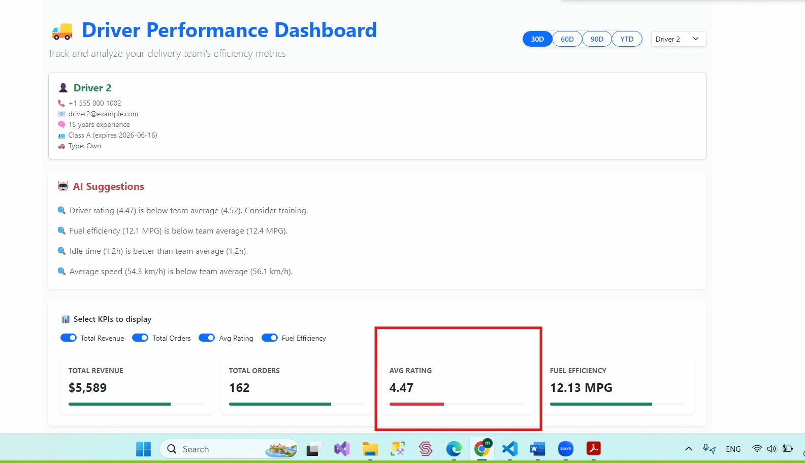

The dashboard allows users to select different KPIs (e.g., Total Revenue, Total Orders, Avg Rating, Fuel Efficiency) and presents them in both numerical and visual formats. Color coding enhances clarity:
- Green indicates good/high values (e.g., excellent fuel efficiency or high average rating)
- Red signals lower performance

The UI adjusts dynamically based on selected timeframes (30D, 60D, etc.), and all metric visuals update accordingly to reflect the chosen data slice.

### Screenshot 2 – 60-Day KPI Summary
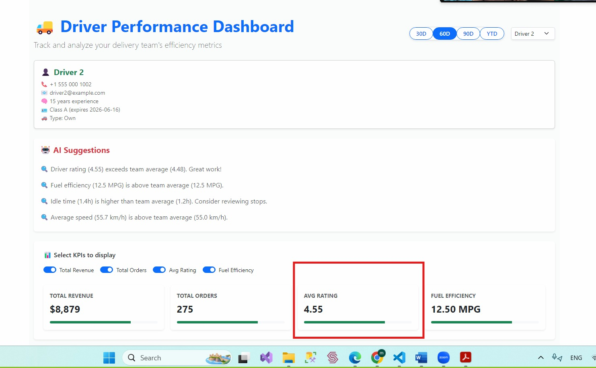

### Screenshot 3 – Multi-Metric KPI Trends
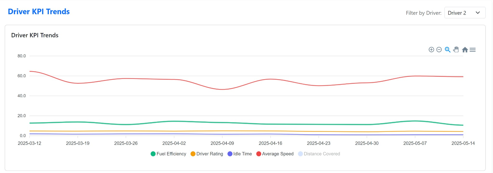

Here I used another way to display Key Performance Indicators (KPIs), and the user can include or exclude metrics as needed. Trends are shown using smooth curves and distinct colors for each metric (e.g., Fuel Efficiency in green, Average Speed in red). The toggling mechanism allows full control over what to analyze visually, making it an interactive and user-responsive experience.

### Screenshot 4 – Fuel Efficiency Trend View
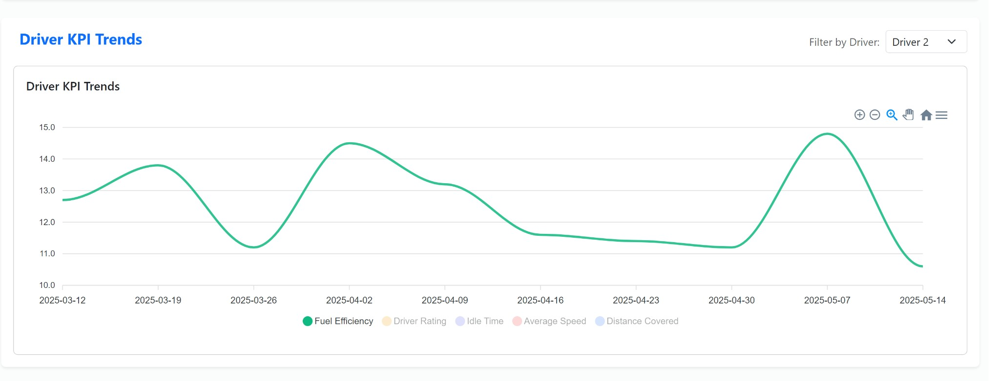

### Screenshot 5 – Deliveries Trend Analysis
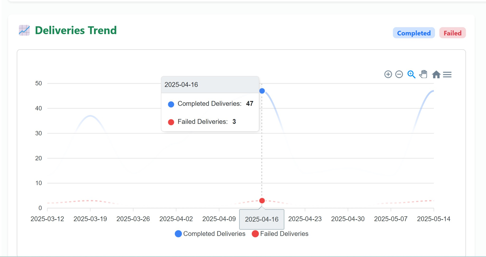

Another visualization showcases delivery success trends. The graph differentiates Completed Deliveries (blue) and Failed Deliveries (red) with clear curves and legends. Interactive tooltips allow precise insight into daily performance, offering a quick visual understanding of reliability and delivery consistency.

### Screenshot 6 – Delivery Punctuality (Donut Chart)
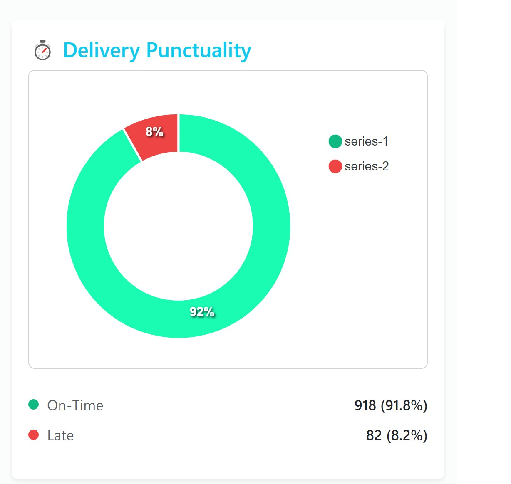

This donut chart presents on-time vs. late deliveries in a percentage format. The green portion reflects deliveries that were on time (91.8%), while the red portion shows late deliveries (8.2%). This visualization gives a clean and immediate insight into service reliability and punctuality.

### Screenshot 7 – Driver Route Map & Top Stops
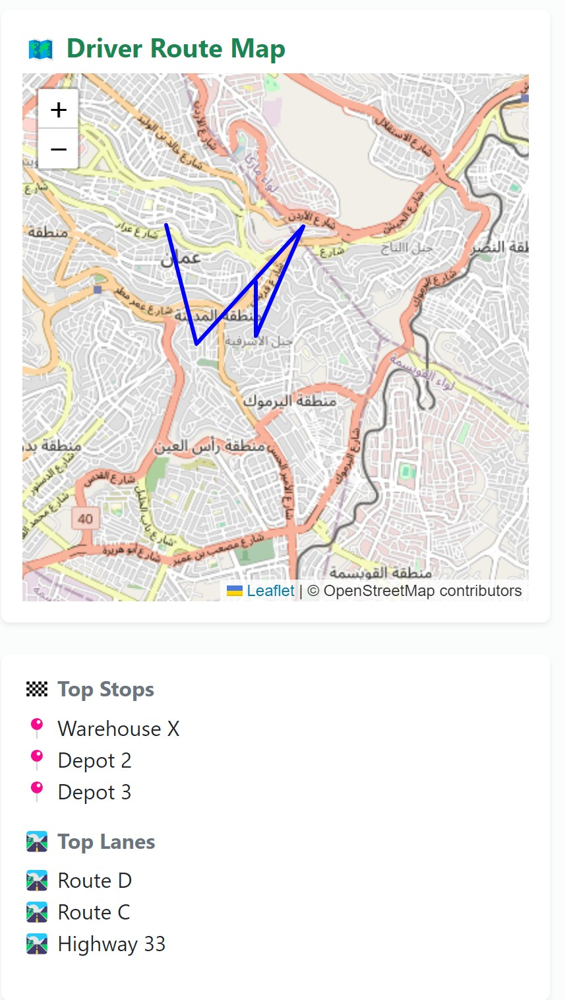

This screen shows the route taken by the driver visualized using Leaflet and OpenStreetMap. The polyline highlights the delivery path, while the Top Stops section tracks commonly visited depots and warehouses. The Top Lanes display frequently used routes and highways. This provides valuable insights into delivery coverage areas and routing behavior, helping optimize route planning and reduce fuel consumption.

### Screenshot 8 – Driver Efficiency Ratings (Bar Chart)
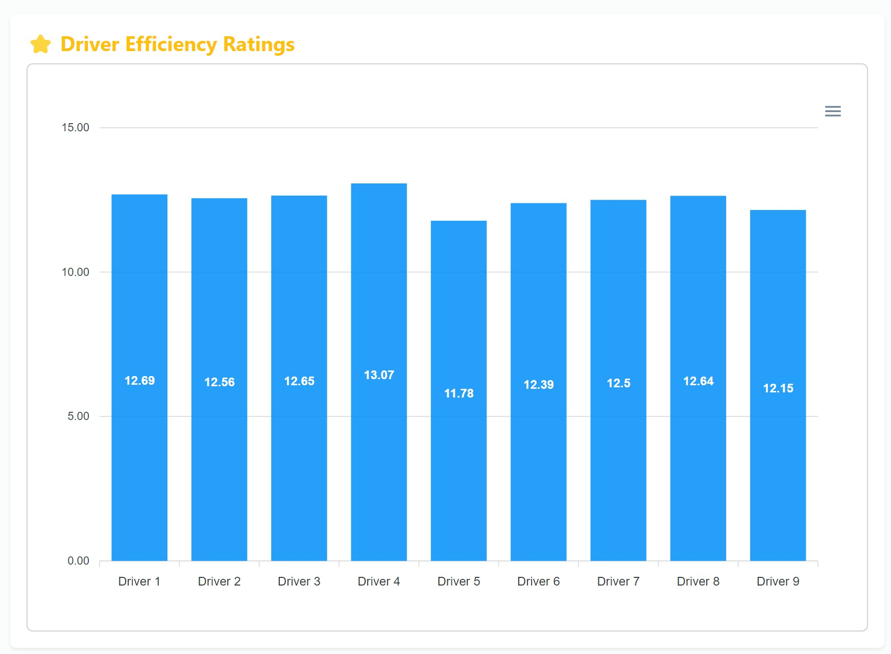

This bar chart compares the efficiency ratings of multiple drivers. Each bar shows the numerical efficiency score, allowing quick identification of high and low performers. This visualization supports decision-making for training, rewards, or operational adjustments based on consistent comparative metrics.

### Screenshot 9 – Top Performing Drivers List
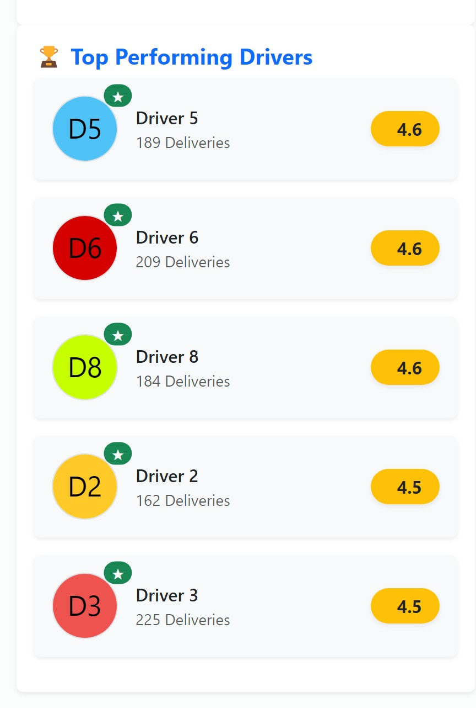

This card-style list highlights top-performing drivers based on delivery count and ratings. Each entry shows the driver's ID, total number of deliveries, and their average rating. This component provides a ranked overview of standout drivers and is useful for quick performance benchmarking, recognition programs, or motivational analysis.

Additionally, this section allows for comparing drivers within the same type (e.g., Broker, Own), enabling more accurate peer-to-peer performance evaluation.

### Screenshot 10 – Broker Type Filtered View
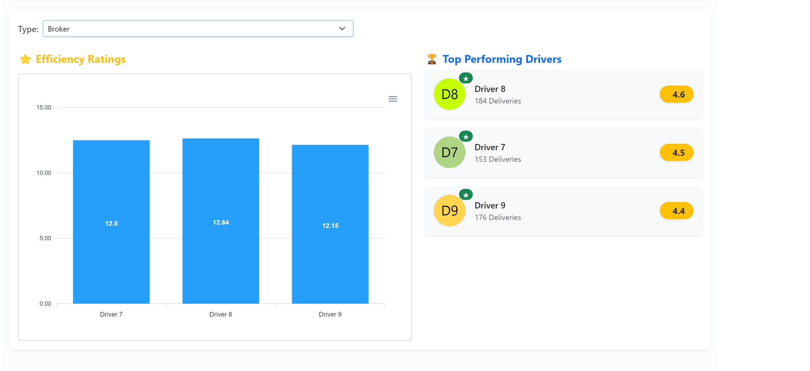

Explanation: This screen allows the user to filter efficiency and top drivers based on type, in this case, 'Broker'. Once selected, only data specific to brokers is shown, including efficiency bar charts and corresponding driver performance cards. This supports segmented performance evaluation, ensuring comparisons are contextual to driver categories.

### Screenshot 11 – Mobile Responsive View
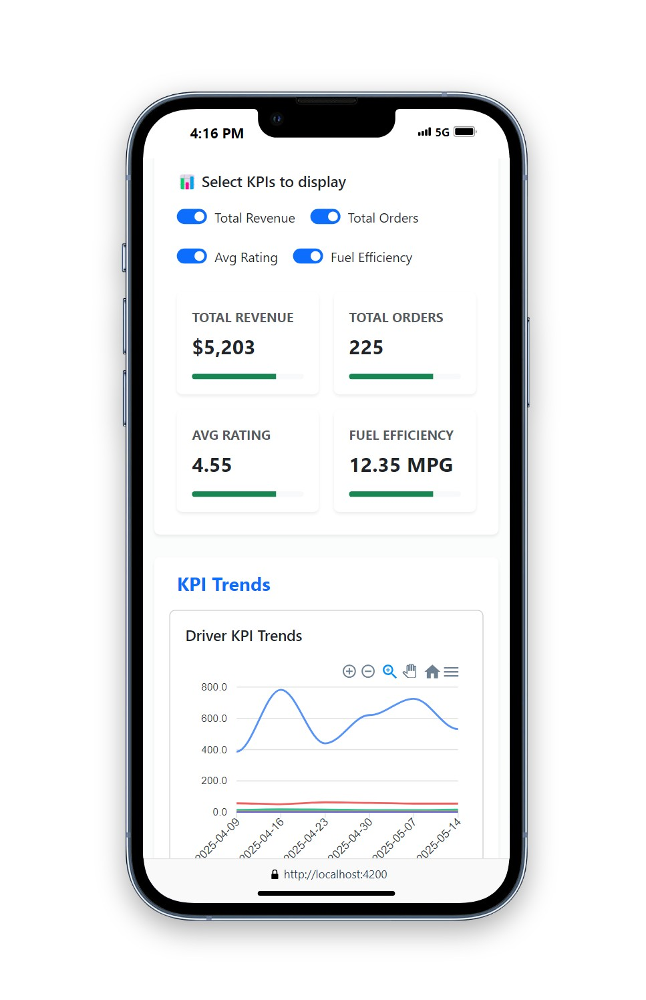

Explanation: This screenshot demonstrates that the dashboard is fully responsive on mobile devices.

### Screenshot 12 – Driver Detail View
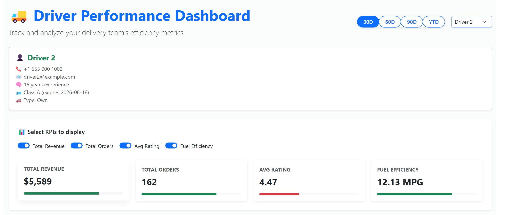

Explanation: This view shows detailed information for a selected driver, including contact info, license type, and personalized KPIs (total revenue, total orders, fuel efficiency, average rating). The user can select which KPIs to display.

### Screenshot 13 – AI Suggestions

This AI-powered section provides real-time suggestions based on driver metrics compared to team averages. Examples include suggestions to consider training if a driver’s rating is below average or highlight positive notes when idle time is better than the team.

## Summary

By integrating AI tools such as ChatGPT, DeepSeek, Canva, and design inspiration from Dribbble into all stages of the project lifecycle, the development process became faster, more efficient, and more insightful. The AI tools not only accelerated development but also helped maintain clean code principles, such as separation of concerns, modular design, and consistent naming.

This approach serves as a real-world example of an AI-Driven Development Workflow.

> "Effective and transparent use of AI tools across all development phases—user stories, code generation, testing, insights, documentation."

## Next Steps (Suggested by AI)
- Automate KPI trend analysis
- Integrate AI-based driver performance prediction
- Expand documentation using AI summarization tools
- Create chatbot for driver FAQs using OpenAI API